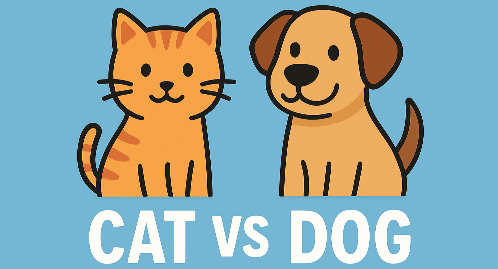
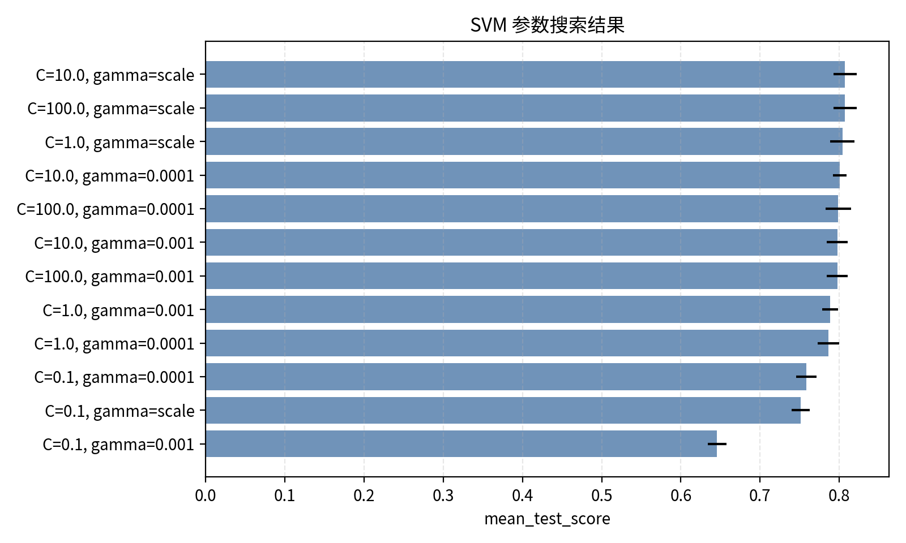
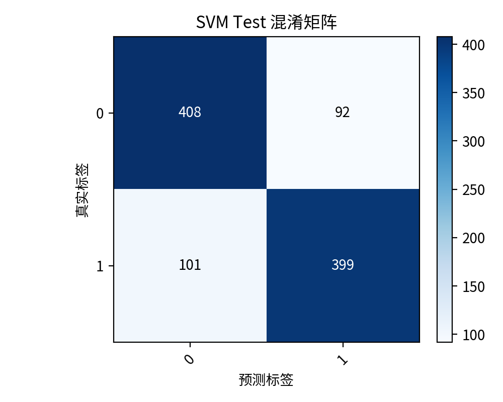
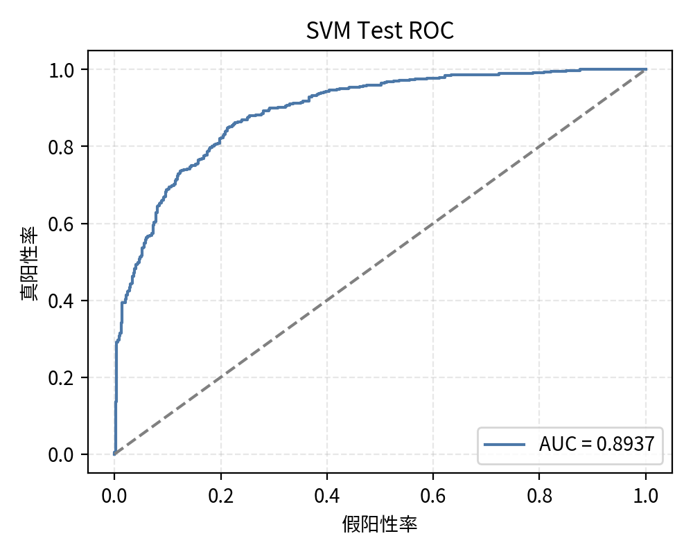
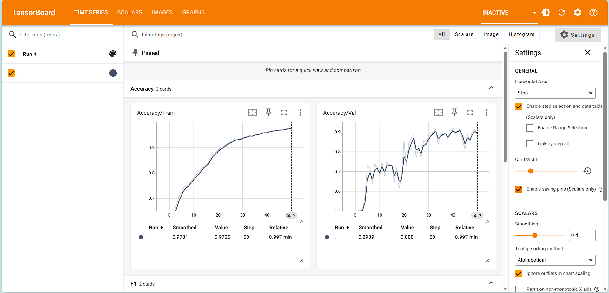
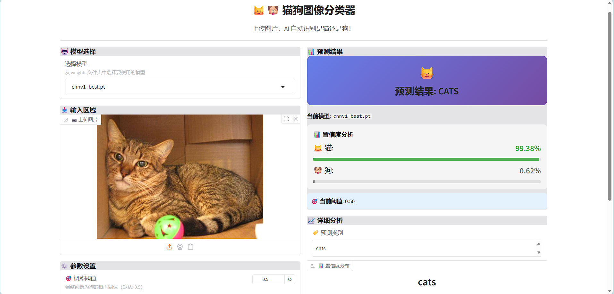

# 🐱🐶 Cat-Dog-Classification



## 📋 项目简介

你是否曾经好奇过，计算机是如何像人类一样识别图片中的猫和狗？这个项目将带你深入探索图像分类的奇妙世界！

这是一个**全面而有趣**的🐱🐶猫狗图像分类项目，它不仅实现了多种传统机器学习方法，还包含了深度学习卷积神经网络的完整实现。无论你是想探索特征工程、初步学习深度学习，还是想快速搭建一个实用的图像分类系统，这个项目都能满足你的需求。

**🌟 项目亮点**

- **📊 传统 ML 模型**：支持向量机(SVM)、逻辑回归(logistic regression)、随机森林(random forest)，配合 10 种不同的手工特征提取
- **🎯 集成学习**：投票集成(voting)、堆叠泛化(stacking)、自适应增强(AdaBoost)
- **🔥 深度学习模型**：自定义 CNN，ResNet18/34/50，支持端到端训练
- **🔍 智能特征搜索**：使用束搜索算法(Beam Search)自动寻找最优特征组合
- **🌐 Web 界面**：基于 Gradio 的友好交互界面，支持实时图像分类
- **📈 完整可视化**：TensorBoard 支持、自动生成训练报告和性能分析图表

如果你是机器学习初学者，这个项目可以提供宝贵的实践经验，让我们一起用代码教会计算机识别这些可爱的毛茸茸朋友们吧！✨

## 📑 目录

- [🐱🐶 Cat-Dog-Classification](#-cat-dog-classification)
  - [📋 项目简介](#-项目简介)
  - [📑 目录](#-目录)
  - [📁 项目结构](#-项目结构)
  - [🚀 快速开始](#-快速开始)
    - [⚙️ 环境配置](#️-环境配置)
      - [创建虚拟环境](#创建虚拟环境)
      - [安装依赖](#安装依赖)
      - [验证安装](#验证安装)
    - [📦 数据集准备](#-数据集准备)
    - [🤖 传统机器学习方法](#-传统机器学习方法)
      - [特征工程](#特征工程)
      - [基础模型训练](#基础模型训练)
      - [训练结果](#训练结果)
      - [集成学习](#集成学习)
    - [🔥 深度学习方法](#-深度学习方法)
      - [数据增强](#数据增强)
      - [模型训练](#模型训练)
      - [训练结果](#训练结果-1)
      - [推理预测](#推理预测)
  - [🎨 可视化](#-可视化)
    - [📊 自动生成的可视化](#-自动生成的可视化)
    - [📈 TensorBoard 可视化](#-tensorboard-可视化)
    - [🌐 Web 界面](#-web-界面)
  - [📧 联系方式](#-联系方式)

## 📁 项目结构

```
Cat_Dog_Classification/
├── dataset/
│   ├── train/                     # 训练集
│   │   ├── cats/
│   │   └── dogs/
│   ├── val/                       # 验证集
│   └── test/                      # 测试集
│
├── src/
│   ├── data/
│   │   ├── data_utils.py          # 数据加载和预处理
│   │   ├── feature_extraction.py  # 特征提取
│   │   └── feature_search.py      # 特征搜索
│   ├── features/
│   │   ├── hog.py                 # HOG 特征
│   │   ├── color_hist.py          # 颜色直方图
│   │   ├── lbp.py                 # LBP 特征
│   │   ├── glcm.py                # GLCM 纹理特征
│   │   ├── gabor.py               # Gabor 滤波器
│   │   └── ...                    # 其他特征
│   ├── models/
│   │   ├── cnn.py                 # CNN 模型
│   │   ├── resnet.py              # ResNet 模型
│   │   ├── svm.py                 # SVM 模型
│   │   ├── logistic_regression.py # 逻辑回归
│   │   └── random_forest.py       # 随机森林
│   └── utils/
│       ├── config.py              # 配置管理
│       ├── torch_training.py      # PyTorch 训练工具
│       ├── ml_training.py         # 传统 ML 训练工具
│       ├── inference_utils.py     # 推理工具
│       └── logger.py              # 日志工具
│
├── tools/
│   ├── visualization.py           # 可视化工具
│   ├── reporting.py               # 报告生成
│   └── check_gpu_cuda.py          # GPU 检查
│
├── runs/
│   ├── torch_resnet34_*/          # ResNet34 训练结果
│   ├── torch_resnet18_*/          # ResNet18 训练结果
│   ├── torch_cnn-*/               # CNN 训练结果
│   ├── sklearn_*/                 # sklearn 模型结果
│   └── ensemble_*/                # 集成学习结果
│
├── weights/                       # 预训练权重
│
├── train_torch.py                 # PyTorch 训练入口
├── train_sklearn.py               # sklearn 训练入口
├── ensemble.py                    # 集成学习脚本
├── infer.py                       # 推理脚本
├── gradio_run.py                  # Gradio Web 界面
├── requirements.txt               # Python 依赖
├── LICENSE                        # 许可证
└── README.md                      # 项目说明
```

## 🚀 快速开始

### ⚙️ 环境配置

#### 创建虚拟环境

```bash
# 使用 conda
conda create -n catdog python=3.11
conda activate catdog

# 或使用 venv
python -m venv venv
source venv/bin/activate  # Linux/macOS
# 或
venv\Scripts\activate  # Windows
```

#### 安装依赖

```bash
# 安装与本地cuda版本对应的 PyTorch，访问 https://pytorch.org/ 获取正确的安装命令，例如：
pip install torch==2.6.0 torchvision==0.21.0 torchaudio==2.6.0 --index-url https://download.pytorch.org/whl/cu126

# 安装基础依赖
pip install -r requirements.txt
```

#### 验证安装

```bash
# 检查 GPU 是否可用
python tools/check_gpu_cuda.py
```

### 📦 数据集准备

本项目使用的数据集可以从以下地址下载：[Cat-and-Dog](https://www.kaggle.com/datasets/tongpython/cat-and-dog)。

下载后，将数据集按以下结构组织：

```
dataset/
├── train/              # 训练集
│   ├── cats/           # 猫的图片
│   └── dogs/           # 狗的图片
├── val/                # 验证集
│   ├── cats/
│   └── dogs/
└── test/               # 测试集
    ├── cats/
    └── dogs/
```

其中，训练集、验证集、测试集的比例为 $8:1:1$

### 🤖 传统机器学习方法

#### 特征工程

传统机器学习模型依赖特征工程，本项目实现了多种特征提取方法(以缩放到 $128 \times 128$ 的图像为例)：

| 特征类型  | 说明 | 维度 | 用途 |
| ------ | -----  | ----- | ----- |
| **HOG** | 方向梯度直方图，捕获边缘和形状信息 | 1764 | 主要特征 |
| **颜色直方图** | RGB/HSV 颜色分布 | 512 | 颜色特征 |
| **SIFT** | 尺度不变特征变换 | 291 | 关键点特征 |
| **Gabor** | Gabor 滤波器响应 | 64 | 多尺度纹理 |
| **边缘直方图** | 边缘方向分布 | 42 | 边缘特征 |
| **LBP** | 局部二值模式，纹理特征 | 10 | 纹理分析 |
| **颜色矩** | 颜色通道的均值、标准差、偏度 | 9 | 颜色特征 |
| **Hu 不变矩** | 图像形状不变矩 | 7 | 形状特征 |
| **角点边缘密度** | 角点和边缘密度统计 | 7 | 结构特征 |
| **GLCM** | 灰度共生矩阵，纹理统计 | 6 | 纹理特征 |

为找到最优的特征组合，本项目使用了 **束搜索（Beam Search）** 算法自动对特征组合进行搜索，帮助提升传统机器学习模型的性能。

> 💡 **提示**：特征搜索主要用于传统机器学习模型，建议在训练传统 ML 模型之前先运行特征搜索，找到最佳特征组合。

**功能特点：**

- 🔍 **束搜索算法**：高效搜索最优特征组合
- 📊 **交叉验证评估**：使用 5 折交叉验证评估特征组合性能
- 🎯 **自动特征选择**：从 10 种特征中自动选择最佳组合
- 📉 **PCA 降维**：自动处理高维特征，使用 PCA 降维到 512 维
- 💾 **结果保存**：自动保存搜索历史和最佳结果

**使用方法：**

```bash
# 使用默认配置（推荐）
python src/data/feature_search.py

# 自定义配置（详见代码）
python src/data/feature_search.py \
    --model svm \
    --cv 5 \
    --sample_ratio 0.8 \
    --pca-components 512 \
    --n_jobs 16 \
    --beam-width 5 \
    --out-dir runs/feature_search
```

**搜索过程**：
- 第 1 步：评估 10 个单特征，保留 top 5
- 第 2 步：扩展为 2 特征组合，评估 35 个组合
- 第 3-8 步：逐步增加特征数量，最终找到 8 特征最优组合
- 总评估次数：约 200+ 个特征组合
> 注：通过`pca-components`参数设置PCA降维（默认为512），即若特征组合总维数 > 512，则自动调用PCA降维到512；否则不调用。

**单特征得分排名**：
1. 🥇 **HOG**（方向梯度直方图）- 77.07% ± 1.36%
2. 🥈 **SIFT**（尺度不变特征变换）- 70.82% ± 1.47%
3. 🥉 **Edge Histogram**（边缘直方图）- 64.47% ± 1.19%
4. **LBP**（局部二值模式）- 63.98% ± 0.93%
5. **GLCM**（灰度共生矩阵）- 63.46% ± 1.27%
6. **Corner Edge**（角点边缘密度）- 62.97% ± 0.91%
7. **Gabor**（Gabor 滤波器）- 62.91% ± 1.02%
8. **Color Hist**（颜色直方图）- 62.36% ± 0.71%
9. **Color Moments**（颜色矩）- 61.02% ± 1.26%
10. **Hu Moments**（Hu 不变矩）- 54.47% ± 0.93%

根据实验，**最佳特征组合**为 color_hist + corner_edge + edge_hist + gabor + glcm + hog + lbp + sift，得分：**80.14% ± 1.08%**。

特征搜索完成后，会在输出目录生成：
- `search_results.json` - 搜索结果（最佳组合、搜索历史、特征信息）
- `feature_search.log` - 详细搜索日志

之后，会自动以搜索到的最佳组合对完整数据集进行特征提取，并将特征文件保存在`features`目录下。

#### 基础模型训练

**超参数搜索**

所有传统机器学习模型都支持**自动超参数搜索**，使用 `GridSearchCV` 和 **5折交叉验证**来找到最佳超参数组合。训练过程会自动评估多个参数组合，选择交叉验证得分最高的配置。

**SVM（支持向量机）参数搜索：**

<table>
    <thead>
        <tr>
            <th>搜索参数</th>
            <th>默认搜索范围</th>
            <th>最佳参数示例</th>
            <th>CV准确率</th>
        </tr>
    </thead>
    <tbody>
        <tr>
            <td><code>C</code>（正则化强度）</td>
            <td>[0.1, 1.0, 10.0, 100.0]</td>
            <td>10.0</td>
            <td rowspan="2">80.71% ± 1.45%</td>
        </tr>
        <tr>
            <td><code>gamma</code>（RBF核参数）</td>
            <td>['scale', 0.001, 0.0001]</td>
            <td>'scale'</td>
        </tr>
    </tbody>
</table>

**逻辑回归参数搜索：**

<table>
    <thead>
        <tr>
        <th>搜索参数</th>
        <th>默认搜索范围</th>
        <th>最佳参数示例</th>
        <th>CV准确率</th>
        </tr>
    </thead>
    <tbody>
        <tr>
            <td><code>C</code>（正则化强度）</td>
            <td>[0.001, 0.01, 0.1, 1.0, 10.0, 100.0]</td>
            <td>0.1</td>
            <td rowspan="3">77.94% ± 1.35%</td>
        </tr>
        <tr>
            <td><code>penalty</code>（正则化类型）</td>
            <td>['l1', 'l2']</td>
            <td>'l1'</td>
        </tr>
        <tr>
            <td><code>solver</code>（求解器）</td>
            <td>['liblinear', 'lbfgs', 'saga']</td>
            <td>'liblinear'</td>
        </tr>
    </tbody>
</table>

**随机森林参数搜索：**

<table>
    <thead>
        <tr>
        <th>搜索参数</th>
        <th>默认搜索范围</th>
        <th>最佳参数示例</th>
        <th>CV准确率</th>
        </tr>
    </thead>
    <tbody>
        <tr>
            <td><code>n_estimators</code>（树数量）</td>
            <td>[200, 300, 500]</td>
            <td>500</td>
            <td rowspan="5">74.30% ± 1.15%</td>
        </tr>
        <tr>
            <td><code>max_depth</code>（最大深度）</td>
            <td>[10, 15, 20, 30]</td>
            <td>15</td>
        </tr>
        <tr>
            <td><code>min_samples_split</code>（最小分裂样本数）</td>
            <td>[5, 10, 20]</td>
            <td>20</td>
        </tr>
        <tr>
            <td><code>min_samples_leaf</code>（叶子节点最小样本数）</td>
            <td>[2, 4, 8]</td>
            <td>2</td>
        </tr>
        <tr>
            <td><code>max_features</code>（特征选择策略）</td>
            <td>['sqrt', 'log2']</td>
            <td>'sqrt'</td>
        </tr>
    </tbody>
</table>

**自定义搜索范围：**

```bash
# SVM - 自定义C和gamma搜索范围
python train_sklearn.py --model svm \
    --svm-c-values 0.1 1.0 10.0 100.0 1000.0 \
    --svm-gamma-values scale 0.001 0.0001 0.00001

# 逻辑回归 - 自定义搜索参数
python train_sklearn.py --model logreg \
    --lr-c-values 0.01 0.1 1.0 10.0 \
    --lr-penalty-types l1 l2 \
    --lr-solvers liblinear saga

# 随机森林 - 自定义搜索范围
python train_sklearn.py --model random_forest \
    --rf-n-estimators 100 200 300 500 \
    --rf-max-depth 10 15 20 25 30 \
    --rf-min-samples-split 5 10 15 20
```

**禁用参数搜索（使用默认参数）：**

如果不想进行参数搜索，可以使用 `--no-search` 参数直接使用默认配置训练：

```bash
# 使用默认参数训练（不进行搜索）
python train_sklearn.py --model svm --no-search

# 使用自定义默认参数训练
python train_sklearn.py --model svm --no-search \
    --svm-default-c 10.0 \
    --svm-default-gamma scale
```

**参数搜索性能：**
- 搜索过程使用**并行计算**（默认 `--n-jobs 16`），可显著加速搜索
- 所有参数组合通过 **5折交叉验证评估**，确保结果稳定可靠
- 搜索完成后会自动保存最佳模型和搜索结果到运行目录

#### 训练结果

使用上文提取的**最佳特征组合**（即 color_hist + corner_edge + edge_hist + gabor + glcm + hog + lbp + sift）进行训练

| 模型 | 训练准确率 | 验证准确率 | 测试准确率 | 交叉验证 |
| ----- | ----- | ----- | ----- | ----- |
| 🥇 SVM | 100.00% | **81.50%** | **80.70%** | 5折 |
| 🥈 逻辑回归 | 81.53% | 77.00% | 77.80% | 5折 |
| 🥉 随机森林 | 99.88% | 74.80% | 74.30% | 5折 |

#### 集成学习

```bash
# 软投票集成
python ensemble.py --method voting --voting soft

# 硬投票集成
python ensemble.py --method voting --voting hard

# 堆叠泛化
python ensemble.py --method stacking

# 自适应增强
python ensemble.py --method adaboost
```

> ⚠️ **注**：目前集成学习的效果没有单个SVM模型的好，待修复。

### 🔥 深度学习方法

深度学习模型使用端到端的学习方式，直接从原始图像学习特征表示，无需手工特征工程。

#### 数据增强

为减少过拟合，提高模型的泛化能力，项目采用了以下数据增强技术（仅在训练时使用）：

| 增强方法 | 参数 | 说明 |
| ------ | ------ | ------ |
| **RandomResizedCrop** | scale=(0.9, 1.0), ratio=(0.9, 1.1) | 随机裁剪和缩放，提高泛化能力 |
| **RandomHorizontalFlip** | p=0.5 | 随机水平翻转，增加数据多样性 |
| **RandomRotation** | degrees=10 | 随机旋转 ±10 度，增强鲁棒性 |
| **ColorJitter** | brightness=0.2, contrast=0.2, saturation=0.2, hue=0.1 | 颜色抖动，适应不同光照条件 |
| **GaussianBlur** | kernel_size=3, sigma=(0.1, 1.0) | 高斯模糊，模拟图像模糊 |

验证/测试时：
- 仅使用基础变换：Resize → ToTensor
- 不使用任何随机增强，保证结果可复现

#### 模型训练

**训练命令：**

```bash
# 训练 CNN-v1
python train_torch.py --arch cnn_v1 --batch-size 512 --epochs 120

# 训练 CNN-v2
python train_torch.py --arch cnn_v2 --batch-size 512 --epochs 120

# 训练 ResNet18
python train_torch.py --arch resnet18 --batch-size 512 --epochs 120

# 训练 ResNet34
python train_torch.py --arch resnet34 --batch-size 512 --epochs 120

# 训练 ResNet50
python train_torch.py --arch resnet50 --batch-size 512 --epochs 120
```

**自定义训练参数：**

```bash
# 自定义学习率和调度器
python train_torch.py \
    --arch resnet34 \
    --batch-size 256 \
    --epochs 100 \
    --lr 0.0001 \
    --weight-decay 0.0001 \
    --scheduler cosine \
    --early-stop-patience 15

# 不使用预训练权重（从头训练）
python train_torch.py \
    --arch resnet34 \
    --no-resnet-pretrained \
    --batch-size 128 \
    --epochs 200

# 解冻 backbone（微调整个网络）
python train_torch.py \
    --arch resnet34 \
    --no-freeze-backbone \
    --lr 0.00001 \
    --batch-size 128
```

#### 训练结果

**训练配置：**
- 图像尺寸：224×224
- 权重衰减：0.0001
- 早停耐心值：10
- 混合精度训练（AMP）：✅
- 工作进程数：16
- 优化器：Adam
- 调度器：Cosine

| 模型 | 验证准确率 | 测试准确率 | 最佳轮数 | 批次大小 | 学习率 | 数据增强 | 预训练权重 | 冻结backbone |
| -----|  ----- | ----- | -----| ----- | ----- | ----- | ----- | -----|
| 🥇 ResNet50 | **99.20%** | **98.40%** | 23 | 512 | 0.001 | ✅ | ✅ | ✅ |
| 🥈 ResNet34 |  **98.60%** | **98.30%** | 29 | 512 | 0.001  | ✅ | ✅ | ✅ |
| 🥉 ResNet18 |  **98.10%** | **98.20%** | 13 | 512 | 0.001  | ✅ |✅ | ✅ |
| CNN-v2 | 91.90% | 93.40% | 40 | 512 | 0.001  | ✅ | ❌ | - |
| CNN-v1 |  91.50% | 92.60% | 79 | 512 | 0.001  | ✅ |❌ | - |
| CNN-v2 | 89.80% | 91.60% | 53 | 512 | 0.001  | ❌ | ❌ | - |
| CNN-v1 | 86.20% | 87.30% | 63 | 512 | 0.001  | ❌ |❌ | - |

#### 推理预测

**单张图片推理：**

```bash
# 基础推理
python infer.py \
    --checkpoint runs/torch_resnet34_20251114-105541/best.pt \
    --image path/to/image.jpg

# 保存预测结果
python infer.py \
    --checkpoint runs/torch_resnet34_20251114-105541/best.pt \
    --image path/to/image.jpg \
    --output prediction.json
```

**批量推理：**

```bash
# 推理整个目录
python infer.py \
    --checkpoint runs/torch_resnet34_20251114-105541/best.pt \
    --image-dir dataset/test/ \
    --output predictions.csv

# 导出为 JSON 格式
python infer.py \
    --checkpoint runs/torch_resnet34_20251114-105541/best.pt \
    --image-dir dataset/test/ \
    --output predictions.json \
    --format json
```

**参数选项：**

- `--checkpoint`: 模型检查点路径（必需）
- `--image`: 单张图片路径
- `--image-dir`: 图片目录路径
- `--output`: 输出文件路径
- `--format`: 输出格式（csv/json）
- `--batch-size`: 批量推理批次大小
- `--device`: 推理设备（cuda/cpu）

## 🎨 可视化

### 📊 自动生成的可视化

项目在训练过程中自动生成以下可视化结果（保存在 `runs/*/figures/` 目录）：

- **训练/验证损失曲线** - 监控训练过程，检测过拟合
- **训练/验证准确率曲线** - 评估模型性能提升
- **混淆矩阵** - 分析分类错误模式
- **ROC 曲线** - 评估分类器性能
- **分类报告** - 详细的性能指标（精确率、召回率、F1）

**示例：**








### 📈 TensorBoard 可视化

使用 TensorBoard 实时查看训练过程：

```bash
# 查看单个实验
tensorboard --logdir=runs/torch_resnet34_20251114-105541/events

# 对比多个实验
tensorboard --logdir=runs/

# 指定端口
tensorboard --logdir=runs/ --port 6006
```

**示例：**



### 🌐 Web 界面

**启动 Gradio 界面：**

```bash
python gradio_run.py --server-port 7860
```

启动后，在浏览器中访问显示的 URL（通常是 `http://localhost:7860`）即可使用 Web 界面进行图像分类。

**示例：**



## 📧 联系方式

如有任何问题或建议，欢迎通过Issue提出，也可以发送邮件至 [lxywasd@gmail.com](mailto:lxywasd@gmail.com) 与我联系。

---

**⭐ 如果这个项目对您有帮助，请给个Star支持一下~ ⭐**
